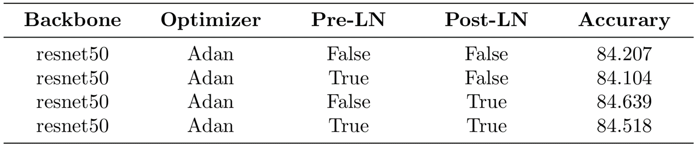
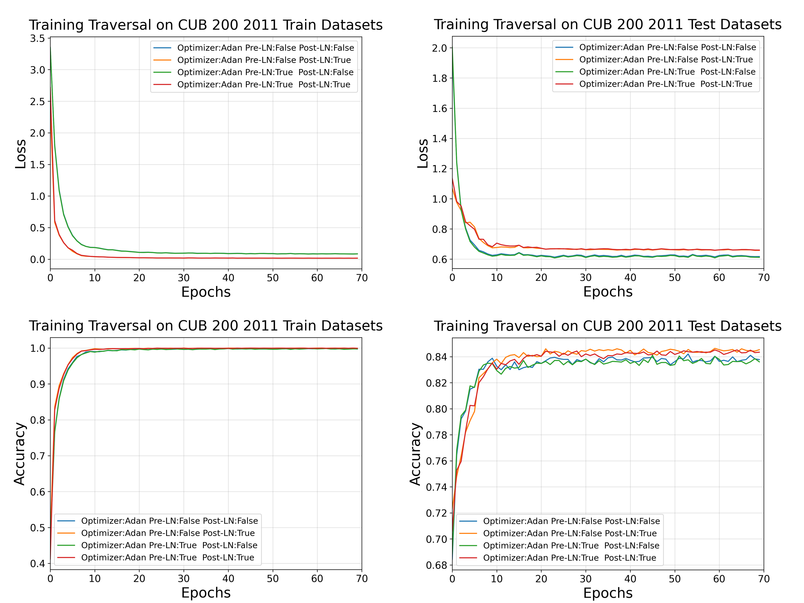

# Peri-LN-Experiment

This is a Deep Learning course (NTNU Laboratory Training Experiment) using PyTorch.

---

## Experiment Result
* The experiments were conducted on the CUB-200-2011 dataset with ResNet50 as the backbone.
* Comparison of different LayerNorm positions: **pre-LN, post-LN, and peri-LN**
* The peri-LN setting follows *Peri-LN: Revisiting Layer Normalization in the Transformer Architecture* ([Kim, J., Lee, B., Park, C., et al., 2025](https://arxiv.org/pdf/2502.02732v1))
* `model.py` is adapted based on the official PyTorch [ResNet implementation](https://github.com/pytorch/vision/blob/main/torchvision/models/resnet.py)

<p float="left">
  
</p>

<p float="left">
  
</p>

```bibtex
@article{kim2025peri,
  title={Peri-LN: Revisiting Layer Normalization in the Transformer Architecture},
  author={Kim, Jeonghoon and Lee, Byeongchan and Park, Cheonbok and Oh, Yeontaek and Kim, Beomjun and Yoo, Taehwan and Shin, Seongjin and Han, Dongyoon and Shin, Jinwoo and Yoo, Kang Min},
  journal={arXiv e-prints},
  pages={arXiv--2502},
  year={2025}
}
